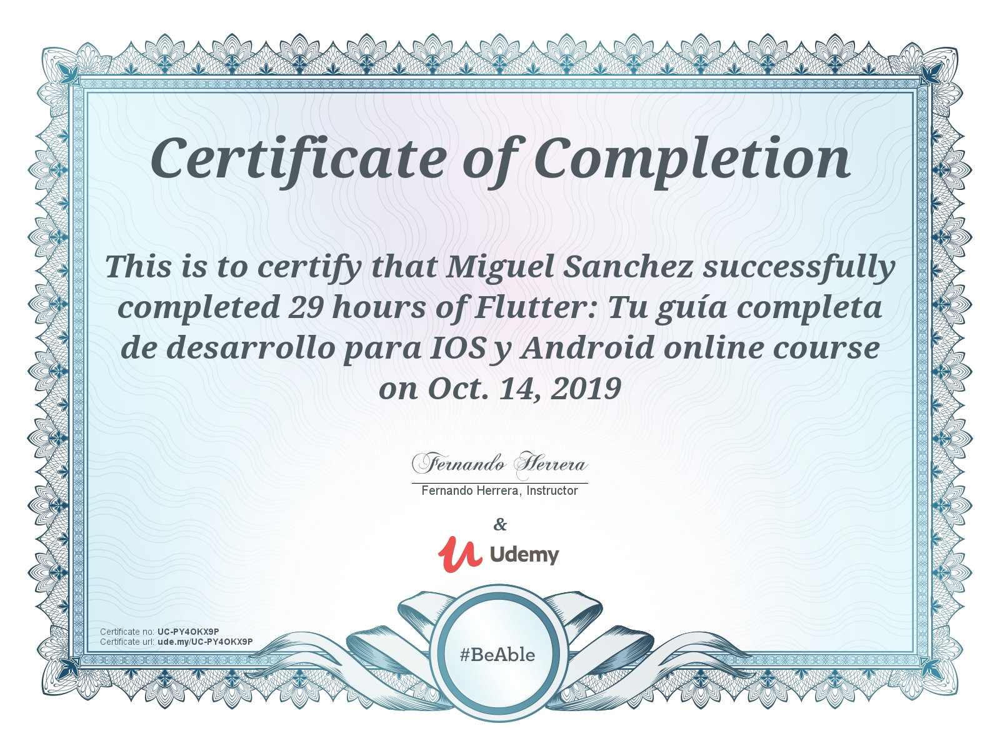

# Flutter complete guide course apps

This reposotory contains the apps developed during the
course.

In this course I learned Flutter from the basics to intermediate level

Some topics reviewed:
* Introduction to Dart lang
* Introduction to Flutter
* Flutter componnets
* Consuming APIs
* Local DB (SQLite)
* User preferences
* Forms
* Push notifications
* Provider state manager
* Google Maps

## Complettition certificate

## Course link
https://www.udemy.com/course/flutter-ios-android-fernando-herrera/
